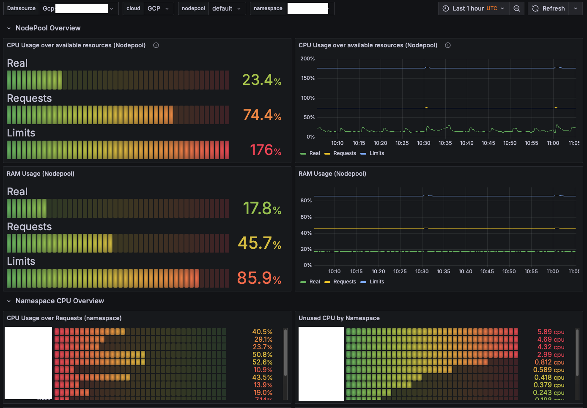
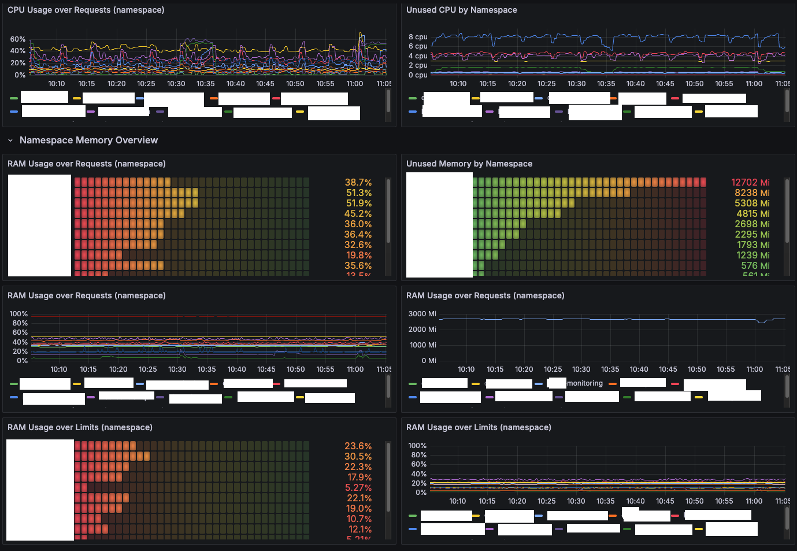
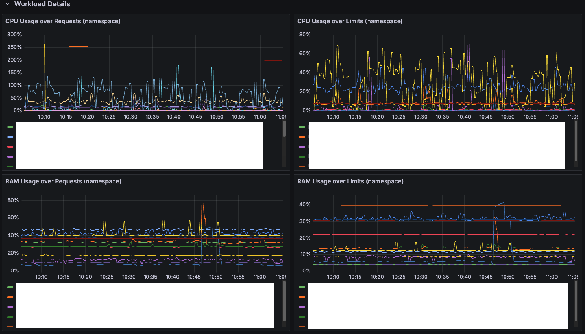

# Grafana RightSizing Dashboard
Grafana dashboard for evaluating overcommitted Kubernetes clusters. This dashboard offered in JSON format offers a variety of rich visualizations to provide a clearer overview of the cluster's status

## Visualizaion example

## Maintainers

[@GeiserX](https://github.com/GeiserX).

## Contributing

Feel free to dive in! [Open an issue](https://github.com/GeiserX/grafana-rightsizing-dashboard/issues/new) or submit PRs.

Grafana RightSizing Dashboard follows the [Contributor Covenant](http://contributor-covenant.org/version/2/1/) Code of Conduct.
