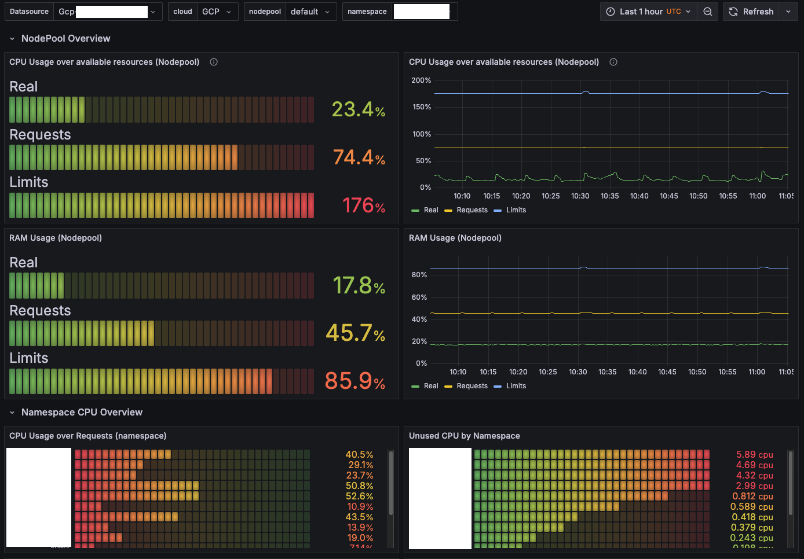
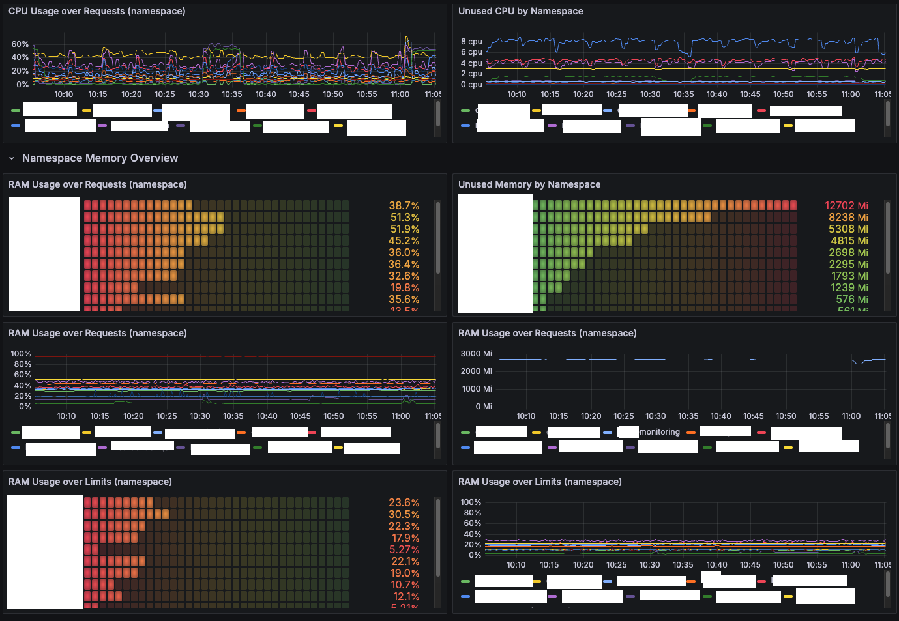
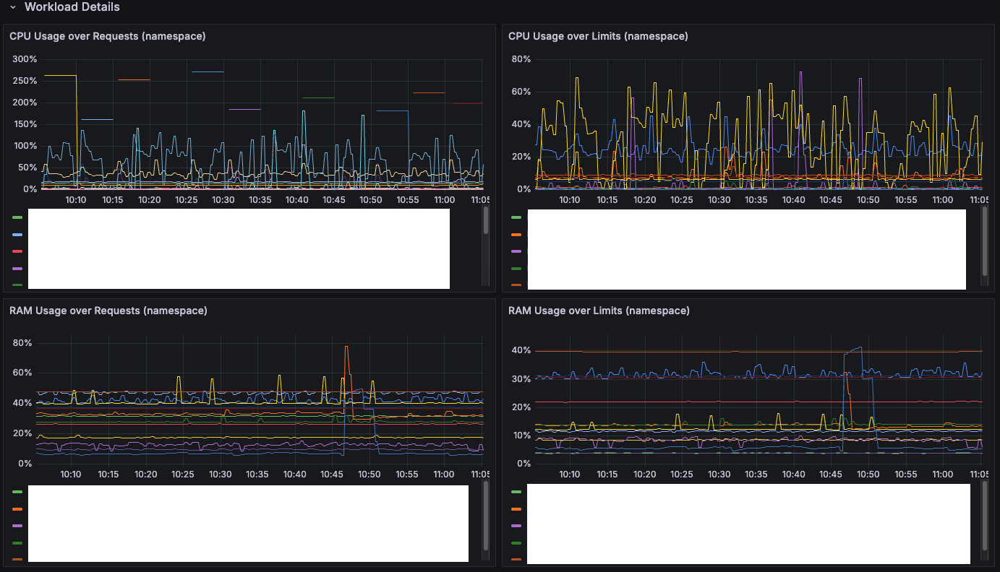

  

<h1 align="center">Grafana Rightsizing Dashboard</h1>

  Grafana dashboard for evaluating overcommitted Kubernetes clusters.

  

---

This dashboard offered in JSON format offers a variety of rich visualizations to provide a clearer overview of the cluster's status.

## Visualization example

## Maintainers

[@GeiserX](https://github.com/GeiserX)

## Contributing

Feel free to dive in! [Open an issue](https://github.com/GeiserX/grafana-rightsizing-dashboard/issues/new) or submit PRs.

Grafana RightSizing Dashboard follows the [Contributor Covenant](http://contributor-covenant.org/version/2/1/) Code of Conduct.
