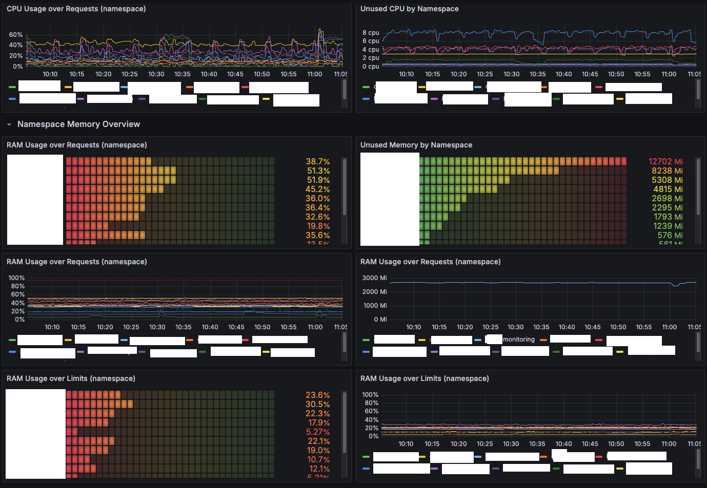

  

<h1 align="center">Grafana Rightsizing Dashboard</h1>

Grafana dashboard that puts CPU and memory usage against requests and limits per namespace and workload, from kube-state-metrics and cAdvisor in Prometheus, to show where a Kubernetes cluster is overcommitted.

## Quick start

In Grafana open Dashboards, New, Import, upload `dashboard.json` and pick your Prometheus datasource when asked. It needs kube-state-metrics, cAdvisor and the kube-prometheus recording rules in that Prometheus; [Usage](docs/usage.md) lists the panels and the metrics behind them.

## Documentation

- [Usage](docs/usage.md): the panels, the namespace filter, and the metrics each one reads

## License

[GPL-3.0-or-later](LICENSE)
