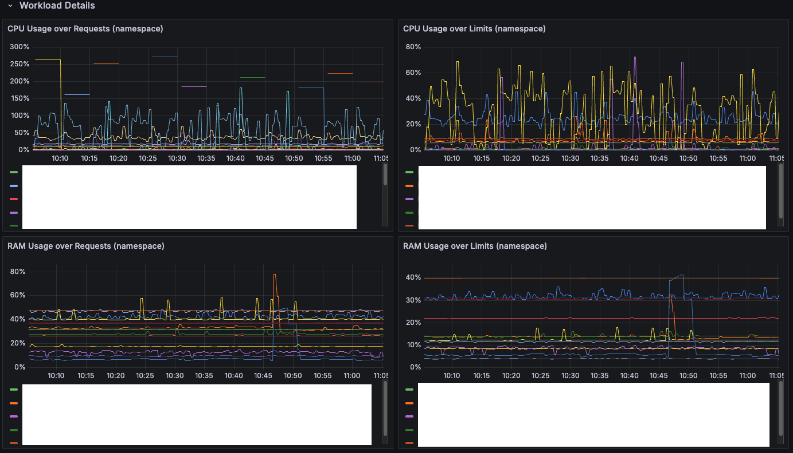

# Usage

## Import

In Grafana open Dashboards, New, Import, upload [`dashboard.json`](https://github.com/GeiserX/grafana-rightsizing-dashboard/blob/main/dashboard.json) and pick your Prometheus datasource. The file is Grafana's export format (`__inputs` with `DS_PROMETHEUS`), so it imports through the UI, which asks for the datasource, and not as a raw body to `POST /api/dashboards/db`.

The `namespace` variable at the top lists the namespaces from `kube_namespace_status_phase` and filters every panel.

## Panels

Three rows:

- **Namespace CPU Overview**: CPU usage over requests per namespace, and the CPU each namespace requested but does not use, as bar gauges and time series.
- **Namespace Memory Overview**: memory usage over requests and over limits per namespace, and unused requested memory, as bar gauges and time series.
- **Workload Details**: CPU and memory usage over requests and over limits for each workload in the selected namespaces.

## Metrics it reads

| Metric | Source |
|---|---|
| `kube_pod_container_resource_requests`, `kube_pod_container_resource_limits`, `kube_pod_owner`, `kube_namespace_status_phase` | kube-state-metrics |
| `container_memory_working_set_bytes` | cAdvisor, through the kubelet |
| `node_namespace_pod_container:container_cpu_usage_seconds_total:sum_irate`, `node_namespace_pod_container:container_memory_working_set_bytes` | the kube-prometheus recording rules, built from cAdvisor's series |

A Prometheus installed with kube-prometheus-stack has all three.
